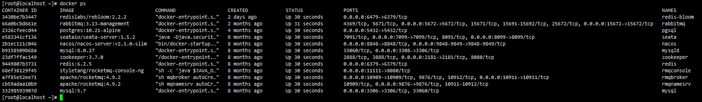

WHILE YOU'RE STILL YOUNG
---

<!--
**lyflexi/lyflexi** is a ✨ _special_ ✨ repository because its `README.md` (this file) appears on your GitHub profile.

Here are some ideas to get you started:

- 🔭 I’m currently working on ...
- 🌱 I’m currently learning ...
- 👯 I’m looking to collaborate on ...
- 🤔 I’m looking for help with ...
- 💬 Ask me about ...
- 📫 How to reach me: ...
- 😄 Pronouns: ...
- ⚡ Fun fact: ...
-->
Requirements and ideas are the origin of programming
### 👉各大开源框架调试案例与业务最佳实践
> 老版合集bak：https://github.com/lyflexi/debuginfo_jdkToFramework

🐞git最佳实践 ：https://github.com/lyflexi/git-practice

🐞jdk基础工具实践与调试，https://github.com/lyflexi/basic-jdk-practice

🐞java多线程实践与调试：https://github.com/lyflexi/java-thread-practice

🐞log4j2日志框架模板调试2024最新版：https://github.com/lyflexi/log4j2-practice ，历史时间轴：Log4J->LogBack->Log4j2(springboot3主推)

🐞23种设计模式实践：https://github.com/lyflexi/designPartens-practice ，你从没见过的基于泛型GenericType封装的23种设计模式

🐞mybatis-plus源码调试与业务最佳实践：https://github.com/lyflexi/mybatis-plus-practice.git
- @See：[basic-debug](https://github.com/lyflexi/mybatis-plus-practice/tree/main/basic-debug) 基础功能与分页、字段拦截、日志、逻辑删除等调试
- @See：[optimistic-lock-plugin](https://github.com/lyflexi/mybatis-plus-practice/tree/main/optimistic-lock-plugin) 乐观锁插件调试
- @See：[auto-partition-procedure](https://github.com/lyflexi/mybatis-plus-practice/tree/main/auto-partition-procedure) 数据表自动分区调试，定时任务+存储过程原理

🐞servlet源码调试与最佳实践(适配Tomcat 10+与新版jakarta)：https://github.com/lyflexi/servlet-practice

🐞spring注解驱动原理调试与最佳实践：https://github.com/lyflexi/spring-practice ，spring核心原理调试，xml、ioc、aop、aware、Bean后置处理器、BeanFactory后置处理器、Listener、tx
- @See：[debug-aop](https://github.com/lyflexi/spring-practice/tree/main/debug-aop) spring-aop调试
- @See：[debug-factory](https://github.com/lyflexi/spring-practice/tree/main/debug-factory) spring-ioc/工厂调试
- @See：[debug-aware](https://github.com/lyflexi/spring-practice/tree/main/debug-aware) spring-aware调试
- @See：[debug-listener](https://github.com/lyflexi/spring-practice/tree/main/debug-listener) spring监听器调试，服务内部事件发布原理
- @See：[debug-tx](https://github.com/lyflexi/spring-practice/tree/main/debug-tx) spring事务控制调试
- @See：[debug-beanlife](https://github.com/lyflexi/spring-practice/tree/main/debug-beanlife) spring-bean的生命周期调试
- @See：[debug-circular-dependency](https://github.com/lyflexi/spring-practice/tree/main/debug-circular-dependency) spring支持循环依赖调试

🐞你从未见过的基于spring封装的23种设计模式：https://github.com/lyflexi/spring-based-design-patterns ，真正的业务落地实现，轻舟已过万重山！
- @See：[strategy-pattern](https://github.com/lyflexi/spring-based-design-patterns/tree/main/strategy-pattern), 基于spring的策略模式
- @See：[duty-pattern](https://github.com/lyflexi/spring-based-design-patterns/tree/main/duty-pattern) ,基于spring的责任链模式

🐞spring-beans修改版源码，证明猜想：https://github.com/lyflexi/spring-three-level-buffer-practice 证明移除第三级缓存不影响框架功能，依旧支持aop场景下的循环依赖

🐞springmvc核心原理与最佳实践：https://github.com/lyflexi/springmvc-practice

🐞springboot源码调试与最佳实践：https://github.com/lyflexi/springboot-practice
- @See：[debug_springboot](https://github.com/lyflexi/springboot-practice/tree/main/debug_springboot) springboot自动装配等核心原理调试
- @See：[custom-robot-starter](https://github.com/lyflexi/springboot-practice/tree/main/custom-robot-starter) 三重境界自定义stater
- @See：[springboot-event](https://github.com/lyflexi/springboot-practice/tree/main/springboot-event) spring泛型事件发布原理，看spring是如何解决泛型擦除

🐞redisson/zk分布式锁源码调试与业务最佳实践：https://github.com/lyflexi/distributed-lock-practice
- @See：[mysqlock](https://github.com/lyflexi/distributed-lock-practice/tree/main/mysqlock) 对比mysql悲观乐观锁
- @See：[jvmlock](https://github.com/lyflexi/distributed-lock-practice/tree/main/jvmlock) 对比jvm加锁
- @See：[redisHandsonDistriLock](https://github.com/lyflexi/distributed-lock-practice/tree/main/redisHandsonDistriLock) 手写redis分布式锁
- @See：[redissonClient](https://github.com/lyflexi/distributed-lock-practice/tree/main/redissonClient) redisson解决方案
- @See：[zkHandsonDistriLock](https://github.com/lyflexi/distributed-lock-practice/tree/main/zkHandsonDistriLock) 手写zk分布式锁
- @See：[zkCurator](https://github.com/lyflexi/distributed-lock-practice/tree/main/zkCurator) zkCurator解决方案

🐞jetcache缓存组件源码调试与业务最佳实践：https://github.com/lyflexi/jetcache-practice
- @See：[basic_jetcache](https://github.com/lyflexi/jetcache-practice/tree/main/basic_jetcache) jetcache核心原理调试
- @See：[custom_jetcache_framework](https://github.com/lyflexi/jetcache-practice/tree/main/custom_jetcache_framework) 自定义jetcache业务框架

🐞nio/netty源码调试与业务最佳实践：https://github.com/lyflexi/netty-practice

🐞rabbitmq源码调试与业务最佳实践：https://github.com/lyflexi/rabbitmq-practice
- @See：[amqp-client](https://github.com/lyflexi/rabbitmq-practice/tree/main/amqp-client) 原生amqp-client客户端调试
- @See：[custom_rabbit_framework](https://github.com/lyflexi/rabbitmq-practice/tree/main/custom_rabbit_framework) 自定义rabbitmq业务框架

🐞rocketmq源码调试与业务最佳实践：https://github.com/lyflexi/rocketmq-practice

🐞springcloudalibaba分布式组件源码调试与业务最佳实践：https://github.com/lyflexi/spring-cloud-alibaba-practice
- @See：[debug_openfeign](https://github.com/lyflexi/spring-cloud-alibaba-practice/tree/main/debug_openfeign) openfeign源码调试/线上循环依赖事故排查
- @See：[custom-openfeign-biz-framework](https://github.com/lyflexi/spring-cloud-alibaba-practice/tree/main/custom-openfeign-biz-framework) openfeign在异步场景下的最佳业务实践
- @See：[debug-nacos](https://github.com/lyflexi/spring-cloud-alibaba-practice/tree/main/debug-nacos) 配置中心与服务中心最佳实践，以及如何提前干预nacos服务的注册行为

🐞xxljob源码调试与业务最佳实践：https://github.com/lyflexi/xxljob-practice
- @See：[custom_xxljob_executor_framework](https://github.com/lyflexi/xxljob-practice/tree/main/custom_xxljob_executor_framework) 自定义xxljob业务框架

🐞easyExcel业务最佳实践：https://github.com/lyflexi/easyExcel-practice
- @See：[custom-framework-reflect](https://github.com/lyflexi/easyExcel-practice/tree/main/custom-framework-reflect) 基于枚举和反射实现的可配置化解析器
- @See：[custom-framework-spring](https://github.com/lyflexi/easyExcel-practice/tree/main/custom-framework-spring) 基于枚举和spring容器实现的可配置化解析器

🐞redisbloom布隆过滤器实践：https://github.com/lyflexi/redis-bloom-practice

🐞guava工具类实践与设计思想：https://github.com/lyflexi/guava-practice

🐞spi机制源码分析：https://github.com/lyflexi/spi-practice
- @See：[spi-ServiceProviderInterface](https://github.com/lyflexi/spi-practice/tree/main/spi-ServiceProviderInterface) jdk-spi
- @See：[spi-jdbc](https://github.com/lyflexi/spi-practice/tree/main/spi-jdbc)  spi-jdbc
- @See：[spring-spi](https://github.com/lyflexi/spi-practice/tree/main/spring-spi) spring-spi
- @See：[dubbo-spi](https://github.com/lyflexi/spi-practice/tree/main/dubbo-spi) dubbo-spi

🐞spring状态机框架实践：https://github.com/lyflexi/spring-statemachine-practice

---
### 👉我写的其他项目/轮子
🚀手写spring框架，助你突破技术瓶颈：https://github.com/lyflexi/MiniSpringFramework

🚀商城项目，分布式是如何进行拆分的：https://github.com/lyflexi/DistributedMall-heima

🚀txt/markdown文本正则匹配与批量替换工具：https://github.com/lyflexi/txt-regex-replace

🚀markdown工程结构中无用图片清理工具：https://github.com/lyflexi/clear-unused-images-in-markdowns

🚀一种低成本的数据脱敏组件实现：https://github.com/lyflexi/data-desensitization

🚀手写mybatis框架，又见老伙计FactoryBean：https://github.com/lyflexi/hands-on-mybatis

🚀IDEA插件开发FeignX（已上架JetBrain）：https://github.com/lyflexi/feignx-plugin

🚀多租户组件的设计与实现：https://github.com/lyflexi/handson-mulit-tenant

🚀针对长定时任务的监控告警实现：https://github.com/lyflexi/monitor-to-timedTask

🚀针对nacos服务健康的监控告警实现：https://github.com/lyflexi/monitor-to-nacos

### 👉前端工程化
✨Vue3速通：https://github.com/lyflexi/NormalizedVue3

### 👉开发环境
⚡All-Dockers

### 👉Fork项目
🌱guava：https://github.com/lyflexi/guava

🌱PureMVC/puremvc-java-multicore-framework：https://github.com/lyflexi/puremvc-java-multicore-framework

🌱spring-source-tuling：https://github.com/lyflexi/spring-source-tuling

🌱haidnorJVM（手写JVM）：https://github.com/lyflexi/haidnorJVM

🌱jump-to-controller（IDEA插件开发）：https://github.com/lyflexi/jump-to-controller

🌱MybatisX（IDEA插件开发）：https://github.com/lyflexi/MybatisX
